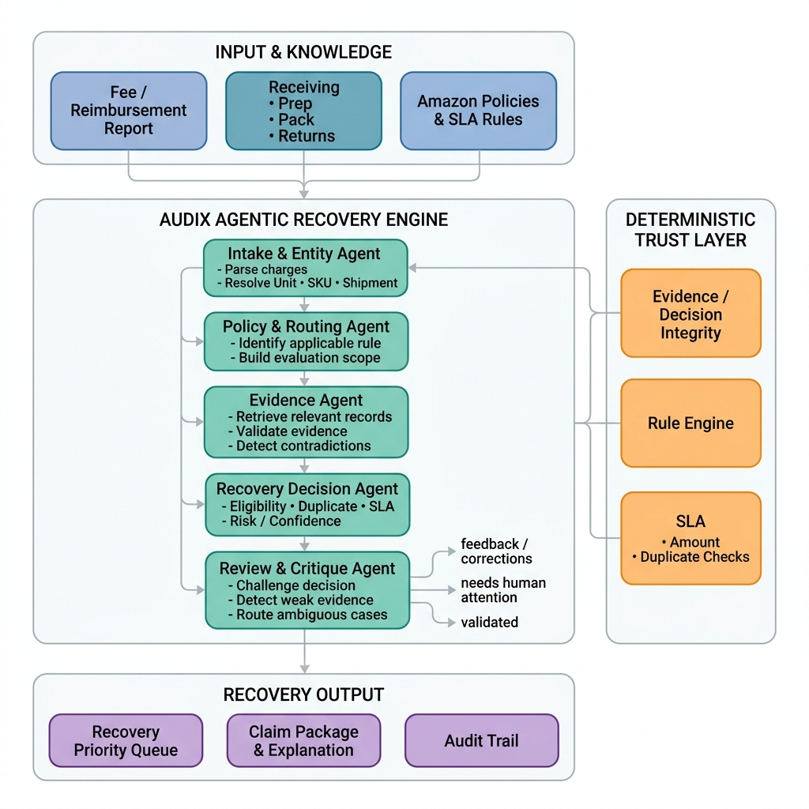

# AUDIX — Architecture Documentation

> AUDIX (AI-Powered Recovery Intelligence) is an agentic, evidence-driven system for Amazon FBA fee and reimbursement recovery. Every decision is deterministic, traceable, and defensible.

---

## System Architecture



The system operates as a **multi-agent pipeline** where each agent has a single, scoped responsibility. No agent fabricates — each can only act on what is explicitly present in the evidence and rules.

---

## Components

### 1. Input & Knowledge Layer

| Input | Description |
|-------|-------------|
| **Fee / Reimbursement Report** | Amazon Seller Central CSV export of charges (inbound, weight/dim, removal fees, etc.) |
| **Receiving Records** | Warehouse receiving log — unit identity, quantity, damage, carrier |
| **Prep Records** | Prep station log — polybag, FNSKU label, compliance checks |
| **Pack Records** | Pack station log — contents, box verification, disposition verdict |
| **Returns Records** | Returns log — condition, disposition (restock / destroy / liquidate), state |
| **Amazon Policies & SLA Rules** | V1 (pre March 10, 2025) and V2 (post March 10, 2025) policy windows, filing deadlines, claimability rules |

---

### 2. AUDIX Agentic Recovery Engine

Five specialized agents execute in sequence. Each agent's output becomes the input to the next.

#### Agent 1 — Intake & Entity Agent
**File:** `recovery_manager/engine/ingestor.py`

- Parses raw fee/reimbursement report CSV
- Normalizes charge types, amounts, posted dates
- Resolves unit identity: FNSKU → ASIN → Shipment ID → Org ID
- Builds a charge object with all normalized fields
- **Output:** Structured charge list with resolved entity keys

#### Agent 2 — Policy & Routing Agent
**File:** `recovery_manager/engine/sla_engine.py`

- Selects the correct Amazon policy version (V1 or V2) based on charge posted date
- Applies the **Policy Time Machine**: charges before March 10, 2025 use V1 rules; on or after use V2
- Checks SLA filing window: is the charge within the claimable timeframe?
- Determines whether the charge type is claimable under the applicable policy
- **Output:** Policy version, SLA status (within / expired), applicable rules

#### Agent 3 — Evidence Retriever Agent
**File:** `recovery_manager/engine/evidence_matcher.py`

- Queries all 4 upstream stages (Receiving, Prep, Pack, Returns) for records matching the charge's unit identity
- Applies time-window filtering: evidence must fall within the custody window
- Detects contradictions between charge claims and evidence (e.g., charge says "item not returned" but Returns record shows restock)
- **Output:** Matched evidence records per stage, contradiction flags, missing evidence flags

#### Agent 4 — Recovery Decision Agent
**File:** `recovery_manager/engine/classifier.py`

- Computes a **Claimability Score** (0–100) based on:
  - Evidence strength across all stages
  - Policy eligibility
  - SLA status
  - Contradiction presence
  - Duplicate check
- Assigns a **Priority Level**: CRITICAL / HIGH / MEDIUM / LOW
- Assigns a **Verdict**: Supported / Contradicted / Silent / Uncertain / Duplicate Suppressed
- Generates a SHA-256 cryptographic audit hash over all inputs and decision
- **Output:** Scored, classified charge with audit hash

#### Agent 5 — Review & Critique Agent
**File:** `recovery_manager/engine/runner.py` (orchestration includes critique pass)

- Reviews each decision for weak or ambiguous evidence
- Routes cases where confidence is below threshold to the **Human Review Queue**
- Generates **human-readable dispute language** for each claimable charge
- Generates **structured claim packages** (JSON) ready for submission
- **Output:** Claim packages, review queue items, dispute text

---

### 3. Deterministic Trust Layer

Runs in parallel with the agent pipeline. Cannot be bypassed.

| Check | Description |
|-------|-------------|
| **Evidence / Decision Integrity** | SHA-256 hash of charge + evidence + policy + decision. Audit-proof. |
| **Rule Engine** | Hard rules that override agent decisions (e.g., expired SLA = never claim) |
| **SLA & Amount Checks** | Amount bounds validation, SLA deadline enforcement, V1/V2 crosscheck |
| **Duplicate Suppression** | Detects and flags claims already filed for the same charge |

---

### 4. Recovery Output

| Output | Description |
|--------|-------------|
| **Recovery Priority Queue** | Ranked list of claimable charges by priority and score |
| **Claim Package & Explanation** | Human-readable + JSON structured dispute document per charge |
| **Human Review Queue** | Charges requiring human judgment before filing |
| **Audit Trail** | Full decision trace: charge → rule → evidence → score → verdict → hash |

---

## Data Flow

```
CSV Upload / Sample Data
         │
         ▼
┌─────────────────────────────────────────────────────┐
│  Intake & Entity Agent                              │
│  normalize → resolve FNSKU/shipment → charge object │
└─────────────────────────┬───────────────────────────┘
                          │
                          ▼
┌─────────────────────────────────────────────────────┐
│  Policy & Routing Agent                             │
│  posted_date → V1 or V2 → SLA check → rules        │
└─────────────────────────┬───────────────────────────┘
                          │
                          ▼
┌─────────────────────────────────────────────────────┐
│  Evidence Retriever Agent                           │
│  FNSKU+shipment → Receiving+Prep+Pack+Returns match │
│  → contradiction detection → custody window check   │
└─────────────────────────┬───────────────────────────┘
                          │
                    ┌─────┴─────┐
                    │           │
                    ▼           ▼
         ┌─────────────┐   ┌──────────────────┐
         │ Rule Engine  │   │ Recovery Decision │
         │ Hard checks  │   │ Agent 0-100 score │
         └──────┬──────┘   └────────┬─────────┘
                └──────────┬────────┘
                           │
                           ▼
┌─────────────────────────────────────────────────────┐
│  Review & Critique Agent                            │
│  weak evidence → human queue                        │
│  strong evidence → claim package + dispute text     │
└────────────┬──────────────┬──────────────┬──────────┘
             │              │              │
             ▼              ▼              ▼
    Claim Package    Human Review    Audit Trail
    + Priority Queue    Queue        (SHA-256 hash)
```

---

## Model / Agent Usage

### LLM Usage (Server-Side Only)
AUDIX uses an LLM **only for human-readable text generation** — converting structured decision data into natural dispute language. The LLM never determines whether to claim or not claim.

```
Decision (deterministic) ──► LLM ──► Readable explanation
"Score: 82, Verdict: Contradicted,         "Returns record confirms the unit was
Evidence: returns.disposition=restock"  ──►  restocked in factory-sealed condition,
                                             directly contradicting Amazon's
                                             'item not returned' charge."
```

**CRITICAL RULES:**
- `LLM_API_KEY` is **never exposed in frontend code**. All LLM calls are server-side only.
- If LLM is unavailable, AUDIX falls back to structured template-based explanations.
- The claim/do-not-claim **verdict is always deterministic** — the LLM cannot override it.

### Decision Engine (Deterministic)
- Policy selection: date comparison (no ML)
- SLA check: arithmetic on dates
- Evidence matching: key-based join on FNSKU/shipment_id
- Contradiction detection: rule-based field comparison
- Claimability scoring: weighted rule sum
- Duplicate detection: hash-based deduplication

---

## Important Engineering Decisions

### 1. Policy Time Machine (V1/V2 Split)
Amazon changed reimbursement policies on **March 10, 2025**. Applying the wrong policy version leads to incorrect decisions — either invalid claims or missed valid ones. AUDIX applies the correct policy version per charge by comparing `posted_date` against the V2 rollout date.

### 2. Evidence-First, Decision-Second
No charge is classified without first attempting evidence retrieval. A charge with no upstream evidence is flagged `Silent (No Evidence)` rather than auto-claimed. This prevents fabricated claims.

### 3. SHA-256 Audit Hashing
Every decision output carries a SHA-256 hash over `(charge_id, policy_version, evidence_keys, verdict, score, timestamp)`. This makes the audit trail tamper-evident and defensible.

### 4. Deterministic Trust Layer Cannot Be Bypassed
The Rule Engine and SLA checks run as a hard filter layer. Even if the scoring agent produces a high score, an expired SLA deadline will suppress the claim. Rules always win over scores.

### 5. Human Review Queue by Design
AUDIX deliberately routes uncertain cases to humans rather than forcing a binary claim/no-claim. This is a product safety decision: it is better to under-claim than to file a fraudulent or weak claim that Amazon rejects, damaging the seller's account standing.

### 6. SPA Architecture (Single Page Application)
The frontend is a single `index.html` shell with JavaScript-driven routing (`navigateTo()`). This allows the public landing page, demo, and the authenticated `/app` workspace to share the same HTML without page reloads, while the Flask backend handles all data APIs and serves the static assets.

### 7. Multi-Tenant Org Isolation
All charges, evidence, and decisions are scoped by `org_id`. The database schema enforces this at query level, ensuring one seller's data is never accessible to another.

### 8. No LLM Keys in Frontend
Enforced by architecture: the Flask backend is the only process with access to `LLM_API_KEY`. The frontend communicates only with `/api/*` endpoints and receives pre-formatted text. Browser JavaScript cannot access or infer the key.

---

## Technology Stack

| Layer | Technology |
|-------|------------|
| Backend | Python 3.11, Flask |
| Database | PostgreSQL (psycopg2) |
| Frontend | Vanilla HTML/CSS/JS (SPA) |
| LLM | Server-side only, API-key protected |
| Deployment | Any WSGI host (Render, Railway, Cloud Run) |
| Audit | SHA-256 cryptographic hashing |
